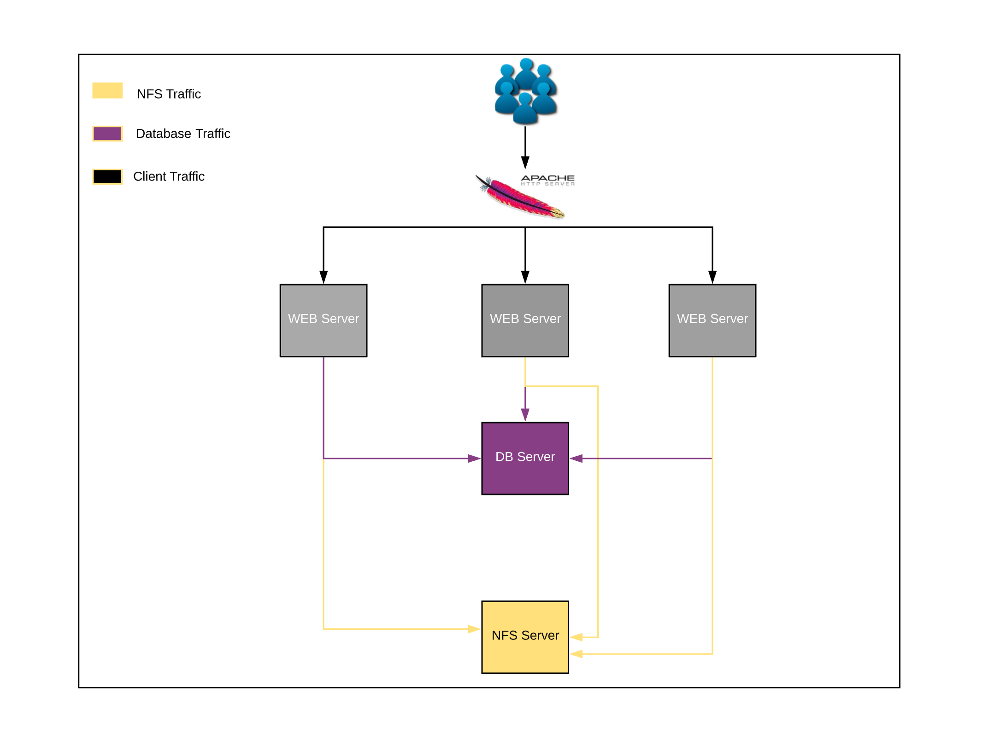

<h1 align="center">Welcome to load-balancer-solution-with-apache 👋</h1>

  

> The whole essence is basically to distribute the traffic load. Imagine if only one server is dedicated to handle requests from 1 million users? What if the requests increase even more, to maybe 10 million. That would be a horrific experience if just one server is responding to all of these requests. No matter the size of the compute power, there is a maximum limit to how you can scale the server vertically.To solve this problem, it is better to scale the servers horizontally (By adding more servers).
> 

[Project Notes](load-balancer-solution-with-apache.md)

## Author
👤 **Dinul Haque**

* Website: https://github.com/dinulhaque
* Github: [@dinulhaque](https://github.com/dinulhaque)
* LinkedIn: [@https:\/\/www.linkedin.com\/in\/dinul-haque-aws-linux-sysadmin\/](https://linkedin.com/in/https:\/\/www.linkedin.com\/in\/dinul-haque-aws-linux-sysadmin\/)

## Show your support

Give a ⭐️ if this project helped you!

***
_This README was generated with ❤️ by [readme-md-generator](https://github.com/kefranabg/readme-md-generator)_