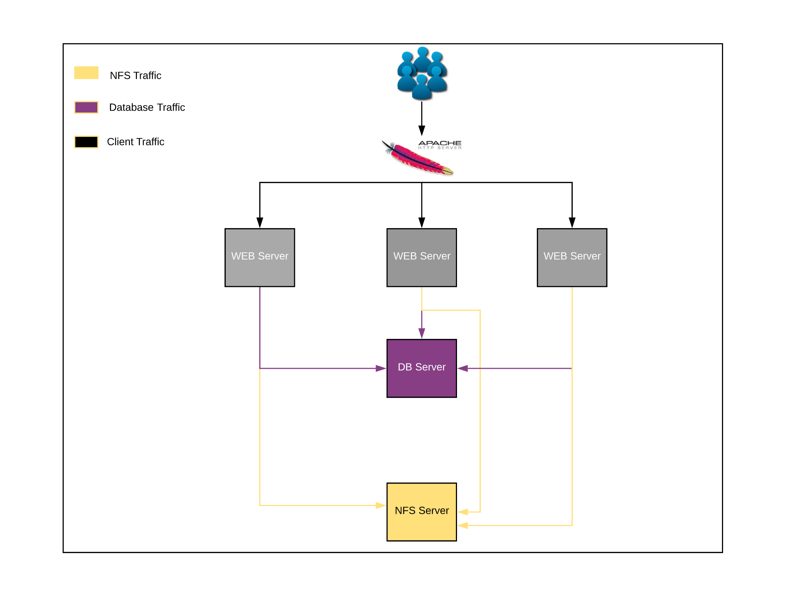

# Load Balancer Solution With Apache

---

Apache-LB - 192.168.1.103

NFS - 192.168.1.116

DB - 192.168.1.114

Web 1 - 192.168.1.117

Web 2 - 192 .168.1.115

Web 3 - 192.168.122



---

## APACHE LB Static IP and Network configuration.

I will set the Apache Load Balancers hostname as apache-lb

```bash
sudo hostnamectl set-hostname apache-lb-devopswithdinul.lan
```

```bash
#Added my known ip to whitelist private IP range
firewall-cmd --permanent --add-source=192.168.1.0/24

```

Setting static IP

```bash
nano /etc/sysconfig/network

#included the following information inside the file and then save and exit the file:

NETWORKING=yes
HOSTNAME=apache-lb-devopswithdinul.lan
GATEWAY=192.168.1.1
NETWORKING_IPV6=no
IPV6INIT=no
```

Edit ifcfg-enp0s3(corresponds to my NIC)

```bash
nano /etc/sysconfig/network-scripts/ifcfg-enp0s3

#I made the following changes:

DNS1=192.168.1.1
DNS2=8.8.8.8
GATEWAY=192.168.1.1
HOSTNAME=apache-lb-devopswithdinul.com
NETMASK=255.255.255.0
IPADDR=192.168.1.103
BOOTPROTO=none
PREFIX=24
DEFROUTE=no
ONBOOT=yes
```

Set the hosts record for other servers

```bash
nano /etc/hosts

#input the following inside the file and save and exit
192.168.1.117 web-host-01-devopswithdinul.lan
192.168.1.115 web-host-02-devopswithdinul.lan
192.168.1.122 web-host-03-devopswithdinul.lan
192.168.1.103 apache-lb-devopswithdinul.lan

```

Apply changes to network configurations.

```bash
sudo nmcli connection down enp0s3 && sudo nmcli connection up enp0s3

output:

Connection 'enp0s3' successfully deactivated (D-Bus active path: /org/freedesktop/NetworkManager/ActiveConnection/1)
Connection successfully activated (D-Bus active path: /org/freedesktop/NetworkManager/ActiveConnection/4)
```

Verify IP changes:

```bash
ip addr|grep enp0s3|grep inet

#Output

[root@apache-lb ~]# ip addr|grep enp0s3|grep inet
    inet 192.168.1.103/24 brd 192.168.1.255 scope global noprefixroute enp0s3
```

To change the IP to static I couldve use nmcli direcly also, Nmcli is a command line tool used to control NetworkManager. By using it I can, among other things, change network settings for a specific interface. In my case I could use nmcli with the connection subcommand with the modify or the edit action. The first step allows to change the settings directly, while the second launches the nmcli shell, where I can operate interactively.

command to do it directly looks like  this 

```bash
sudo nmcli connection modify enp0s3 IPv4.address 192.168.1.103/24 #IP

sudo nmcli connection modify enp0s3 IPv4.gateway 192.168.1.1 #Gateway

sudo nmcli connection modify enp0s3 IPv4.dns 192.168.1.1 #DNS

sudo nmcli connection modify enp0s3 IPv4.method manual #change method to manual

```

## Configuring Apache Load Balancer

```bash
wget [https://www.haproxy.org/download/2.3/src/haproxy-2.3.1.tar.gz](https://www.haproxy.org/download/2.3/src/haproxy-2.3.1.tar.gz) -O ~/haproxy-2.3.1.tar.gz
```

Extract the stable archived files

```bash
tar xzvf ~/haproxy-2.3.1.tar.gz -C ~/
```

Navigate to extracted folder

```bash
cd haproxy-2.3.1/
```

Then compile the program for your system.

```bash
make TARGET=linux-glibc
```

And finally, install HAProxy itself.

```bash
sudo make install
```

Setting up HAProxy for my server

```bash
sudo mkdir -p /etc/haproxy
sudo mkdir -p /var/lib/haproxy 
sudo touch /var/lib/haproxy/stats
```

Creating a symbolic link for the binary to allow you to run HAProxy commands as a normal user.

```bash
sudo ln -s /usr/local/sbin/haproxy /usr/sbin/haproxy
```

I wanted to add the proxy as a service to the system, copied the haproxy.init file from the examples to the /etc/init.d directory. Changed the file permissions to make the script executable and then reload the systemd daemon.

```
sudo cp ~/haproxy-2.3.1/examples/haproxy.init /etc/init.d/haproxy
sudo chmod 755 /etc/init.d/haproxy
sudo systemctl daemon-reload
sudo chkconfig haproxy on
```

HAPROXY version

```bash
HA-Proxy version 2.3.1-bdd7178 2020/11/13 - https://haproxy.org/
Status: stable branch - will stop receiving fixes around Q1 2022.
Known bugs: http://www.haproxy.org/bugs/bugs-2.3.1.html
Running on: Linux 4.18.0-193.28.1.el8_2.x86_64 #1 SMP Thu Oct 22 00:20:22 UTC 2020 x86_64
```

For general usage, it is also recommended to add a new user for HAProxy to be run under.

```bash
sudo useradd -r haproxy
```

Lastly, the firewall on CentOS 8 is quite restrictive for this project by default. Use the following commands to allow the required services and reload the firewall.

```
sudo firewall-cmd --permanent --zone=public --add-service=http
sudo firewall-cmd --permanent --zone=public --add-port=8181/tcp
sudo firewall-cmd --reload
```

---

# Configuring the load balancer

Setting up HAProxy load balancer is a quite straightforward process. Basically, all you need to do is tell HAProxy what kind of connections it should be listening for and where the connections should be relayed to.

This is done by creating a configuration file /etc/haproxy/haproxy.cfg with the defining settings. You can read about the configuration options at HAProxy **[documentation page](https://cbonte.github.io/haproxy-dconv/2.0/configuration.html)** if you wish to find out more.

### Load balancing at layer 4

useful when parts of your web application are located on different hosts. This can be accomplished by conditioning the connection transfer for example by the URL.

Open the HAProxy configuration file with a text editor.

```bash
sudo nano /etc/haproxy/haproxy.cfg
```

The front end declares an ACL rule named url_blog that applies to all connections with paths that begin with /blog. Use_backend defines that connections matching the url_blog condition should be served by the backend named blog_back, while all other requests are handled by the default backend.

At the backend side, the configuration sets up two server groups, http_back like before and the new one called blog_back that servers specifically connections to example.com/blog.

After making the configurations, save the file and restart HAProxy with the next command.

```bash
global
   log /dev/log local0
   log /dev/log local1 notice
   chroot /var/lib/haproxy
   stats timeout 30s
   user haproxy
   group haproxy
   daemon

defaults
   log global
   mode http
   option httplog
   option dontlognull
   timeout connect 5000
   timeout client 50000
   timeout server 50000

frontend http_front
   bind *:80
   stats uri /haproxy?stats
   default_backend http_back

backend http_back
   balance roundrobin
   server web-host-01.devopswithdinul.lan 192.168.1.117:80 check
   server web-host-02.devopswithdinul.lan 192.168.1.115:80 check
	 server web-host-03.devopswithdinul.lan 192.168.1.122:80 check

```

Restart the Haproxy service

```bash
sudo systemctl restart haproxy
```

Result


---

### Web Server Configurations

Setting up static IP, custom hostname and making them persist over system reboots.

Hostname:

- Set Hostname for Web 1

    ```bash
    sudo hostnamectl set-hostname web-host-01.devopswithdinul.lan
    ```

Configure Static IP 

```bash
nano /etc/sysconfig/network

#provide the following inside the file and then save and exit the file:

NETWORKING=yes
HOSTNAME=web-host-01-devopswithdinul.lan
GATEWAY=192.168.1.1
NETWORKING_IPV6=no
IPV6INIT=no
```

Edit ifcfg-enp0s3(corresponds to my NIC)

```bash
nano /etc/sysconfig/network-scripts/ifcfg-enp0s3

#I made the following changes:

DNS1=192.168.1.1
DNS2=8.8.8.8
GATEWAY=192.168.1.1
HOSTNAME=web_host_01-devopswithdinul.lan
NETMASK=255.255.255.0
IPADDR=192.168.1.117
```

Configure hosts file

```bash
nano /etc/hosts

#added the following at the end of the file
192.168.1.103 apache-lb.devopswithdinul.lan
192.168.1.117 web-host-01-devopswithdinul.lan
192.168.1.115 web-host-02-devopswithdinul.lan
192.168.1.122 web-host-03-devopswithdinul.lan
192.168.1.103 apache-lb-devopswithdinul.lan

```

Configured similar setup for Web 2 and Web 3.

To Test I used the following ping command from  apache-lb server

```bash
ping -c 4 web-host-01.devopswithdinul.lan

#Output:

PING web-host-01.devopswithdinul.lan (192.168.1.117) 56(84) bytes of data.
64 bytes from web-host-01.devopswithdinul.lan (192.168.1.117): icmp_seq=1 ttl=64 time=0.428 ms
64 bytes from web-host-01.devopswithdinul.lan (192.168.1.117): icmp_seq=2 ttl=64 time=0.516 ms
64 bytes from web-host-01.devopswithdinul.lan (192.168.1.117): icmp_seq=3 ttl=64 time=0.910 ms
64 bytes from web-host-01.devopswithdinul.lan (192.168.1.117): icmp_seq=4 ttl=64 time=0.607 ms

--- web-host-01.devopswithdinul.lan ping statistics ---
4 packets transmitted, 4 received, 0% packet loss, time 42ms
rtt min/avg/max/mdev = 0.428/0.615/0.910/0.182 ms
[root@apache-lb ~]#

```

### Configure Static IP and Host name for  Database Server

I have already configured my database and imported a SQL dump file from previous project, for more information check out my previous project notes.

I will be showing how I have configured my DB server with static ip and custom hostname.

Set the hostname:

```bash
sudo hostnamectl set-hostname db-devopswithdinul-com
```

Added info to hosts also

```bash
nano /etc/hosts

#Added my db and other server info

192.168.1.117 web-host-01.devopswithdinul.com
192.168.1.115 web-host-02.devopswithdinul.com
192.168.1.122 web-host-03.devopswithdinul.com
```

- Edit netplan/01-network-manager-all.yaml file

```bash
nano /etc/netplan/01-network-manager-all.yaml

#Set the values as below then save and exit
network:
  version: 2
  ethernets:
     enp0s3:
        dhcp4: false
        addresses: [192.168.1.114/24]
        gateway4: 192.168.1.1
        nameservers:
          addresses: [192.168.1.1, 8.8.8.8]
```

To apply changes I did the following:

```bash
sudo netplan apply
```

---

### **Prepare the Web Servers**

I used tail-f command to see the access log on all 3 webservers

```bash
tail -f /var/log/httpd/access_log
```

Results:

Web 1:

```bash
192.168.1.103 - - [27/Nov/2020:23:38:57 -0500] "GET /login.php HTTP/1.1" 200 726 "http://apache-lb-devopswithdinul.lan/login.php" "Mozilla/5.0 (Macintosh; Intel Mac OS X 11_0_1) AppleWebKit/537.36 (KHTML, like Gecko) Chrome/87.0.4280.67 Safari/537.36"
192.168.1.103 - - [27/Nov/2020:23:38:59 -0500] "GET /login.php HTTP/1.1" 200 726 "http://apache-lb-devopswithdinul.lan/login.php" "Mozilla/5.0 (Macintosh; Intel Mac OS X 11_0_1) AppleWebKit/537.36 (KHTML, like Gecko) Chrome/87.0.4280.67 Safari/537.36"
192.168.1.103 - - [27/Nov/2020:23:39:00 -0500] "GET /login.php HTTP/1.1" 200 726 "http://apache-lb-devopswithdinul.lan/login.php" "Mozilla/5.0 (Macintosh; Intel Mac OS X 11_0_1) AppleWebKit/537.36 (KHTML, like Gecko) Chrome/87.0.4280.67 Safari/537.36"
192.168.1.103 - - [27/Nov/2020:23:39:10 -0500] "GET /login.php HTTP/1.1" 200 726 "-" "Mozilla/5.0 (Macintosh; Intel Mac OS X 10_15_6) AppleWebKit/605.1.15 (KHTML, like Gecko) Version/14.0.1 Safari/605.1.15"
192.168.1.103 - - [27/Nov/2020:23:39:14 -0500] "GET /login.php HTTP/1.1" 200 726 "-" "Mozilla/5.0 (Macintosh; Intel Mac OS X 10_15_6) AppleWebKit/605.1.15 (KHTML, like Gecko) Version/14.0.1 Safari/605.1.15"
192.168.1.103 - - [27/Nov/2020:23:39:17 -0500] "GET /login.php HTTP/1.1" 200 726 "-" "Mozilla/5.0 (Macintosh; Intel Mac OS X 10_15_6) AppleWebKit/605.1.15 (KHTML, like Gecko) Version/14.0.1 Safari/605.1.15"
192.168.1.103 - - [27/Nov/2020:23:39:21 -0500] "GET /login.php HTTP/1.1" 200 726 "-" "Mozilla/5.0 (Macintosh; Intel Mac OS X 10_15_6) AppleWebKit/605.1.15 (KHTML, like Gecko) Version/14.0.1 Safari/605.1.15"
HTML, like Gecko) Version/14.0.1 Safari/605.1.15"
```

Web 2:

```bash
192.168.1.103 - - [27/Nov/2020:23:38:58 -0500] "GET /login.php HTTP/1.1" 200 726 "http://apache-lb-devopswithdinul.lan/login.php" "Mozilla/5.0 (Macintosh; Intel Mac OS X 11_0_1) AppleWebKit/537.36 (KHTML, like Gecko) Chrome/87.0.4280.67 Safari/537.36"
192.168.1.103 - - [27/Nov/2020:23:38:59 -0500] "GET /login.php HTTP/1.1" 200 726 "http://apache-lb-devopswithdinul.lan/login.php" "Mozilla/5.0 (Macintosh; Intel Mac OS X 11_0_1) AppleWebKit/537.36 (KHTML, like Gecko) Chrome/87.0.4280.67 Safari/537.36"
192.168.1.103 - - [27/Nov/2020:23:39:01 -0500] "GET /login.php HTTP/1.1" 200 726 "http://apache-lb-devopswithdinul.lan/login.php" "Mozilla/5.0 (Macintosh; Intel Mac OS X 11_0_1) AppleWebKit/537.36 (KHTML, like Gecko) Chrome/87.0.4280.67 Safari/537.36"
192.168.1.103 - - [27/Nov/2020:23:39:10 -0500] "GET /style.css HTTP/1.1" 200 1704 "http://apache-lb-devopswithdinul.lan/login.php" "Mozilla/5.0 (Macintosh; Intel Mac OS X 10_15_6) AppleWebKit/605.1.15 (KHTML, like Gecko) Version/14.0.1 Safari/605.1.15"
192.168.1.103 - - [27/Nov/2020:23:39:15 -0500] "GET /login.php HTTP/1.1" 200 726 "-" "Mozilla/5.0 (Macintosh; Intel Mac OS X 10_15_6) AppleWebKit/605.1.15 (KHTML, like Gecko) Version/14.0.1 Safari/605.1.15"
192.168.1.103 - - [27/Nov/2020:23:39:18 -0500] "GET /login.php HTTP/1.1" 200 726 "-" "Mozilla/5.0 (Macintosh; Intel Mac OS X 10_15_6) AppleWebKit/605.1.15 (KHTML, like Gecko) Version/14.0.1 Safari/605.1.15"
192.168.1.103 - - [27/Nov/2020:23:39:23 -0500] "GET /login.php HTTP/1.1" 200 726 "-" "Mozilla/5.0 (Macintosh; Intel Mac OS X 10_15_6) AppleWebKit/605.1.15 (KHTML, like Gecko) Version/14.0.1 Safari/605.1.15"
HTML, like Gecko) Version/14.0.1 Safari/605.1.15"
```

Web 3:

```bash
192.168.1.103 - - [27/Nov/2020:23:38:59 -0500] "GET /login.php HTTP/1.1" 200 726 "http://apache-lb-devopswithdinul.lan/login.php" "Mozilla/5.0 (Macintosh; Intel Mac OS X 11_0_1) AppleWebKit/537.36 (KHTML, like Gecko) Chrome/87.0.4280.67 Safari/537.36"
192.168.1.103 - - [27/Nov/2020:23:38:59 -0500] "GET /login.php HTTP/1.1" 200 726 "http://apache-lb-devopswithdinul.lan/login.php" "Mozilla/5.0 (Macintosh; Intel Mac OS X 11_0_1) AppleWebKit/537.36 (KHTML, like Gecko) Chrome/87.0.4280.67 Safari/537.36"
192.168.1.103 - - [27/Nov/2020:23:39:10 -0500] "GET /admin_tooling.php HTTP/1.1" 302 2091 "-" "Mozilla/5.0 (Macintosh; Intel Mac OS X 10_15_6) AppleWebKit/605.1.15 (KHTML, like Gecko) Version/14.0.1 Safari/605.1.15"
192.168.1.103 - - [27/Nov/2020:23:39:10 -0500] "GET /favicon.ico HTTP/1.1" 404 209 "http://apache-lb-devopswithdinul.lan/login.php" "Mozilla/5.0 (Macintosh; Intel Mac OS X 10_15_6) AppleWebKit/605.1.15 (KHTML, like Gecko) Version/14.0.1 Safari/605.1.15"
192.168.1.103 - - [27/Nov/2020:23:39:16 -0500] "GET /login.php HTTP/1.1" 200 726 "-" "Mozilla/5.0 (Macintosh; Intel Mac OS X 10_15_6) AppleWebKit/605.1.15 (KHTML, like Gecko) Version/14.0.1 Safari/605.1.15"
192.168.1.103 - - [27/Nov/2020:23:39:19 -0500] "GET /login.php HTTP/1.1" 200 726 "-" "Mozilla/5.0 (Macintosh; Intel Mac OS X 10_15_6) AppleWebKit/605.1.15 (KHTML, like Gecko) Version/14.0.1 Safari/605.1.15"
192.168.1.103 - - [27/Nov/2020:23:39:24 -0500] "GET /login.php HTTP/1.1" 200 726 "-" "Mozilla/5.0 (Macintosh; Intel Mac OS X 10_15_6) AppleWebKit/605.1.15 (KHTML, like Gecko) Version/14.0.1 Safari/605.1.15"
```

After installing mod_ssl site health gone up


Credits:

[How to configure a static IP address on RHEL 8 / CentOS 8 Linux](https://linuxconfig.org/rhel-8-configure-static-ip-address)

[DevOps Career And Mentorship Experts - Darey.io](https://darey.io/dashboard/)

[How to install HAProxy load balancer on CentOS](https://upcloud.com/community/tutorials/haproxy-load-balancer-centos/)